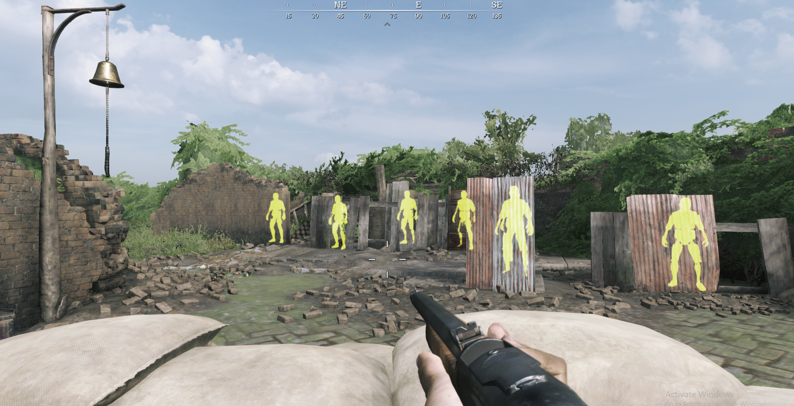
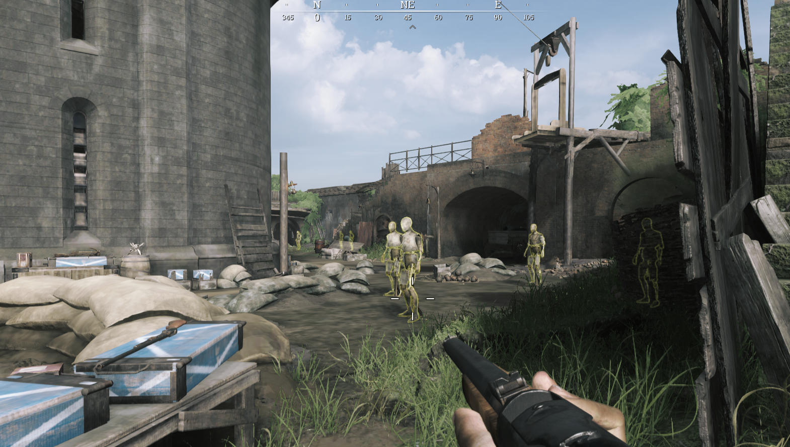
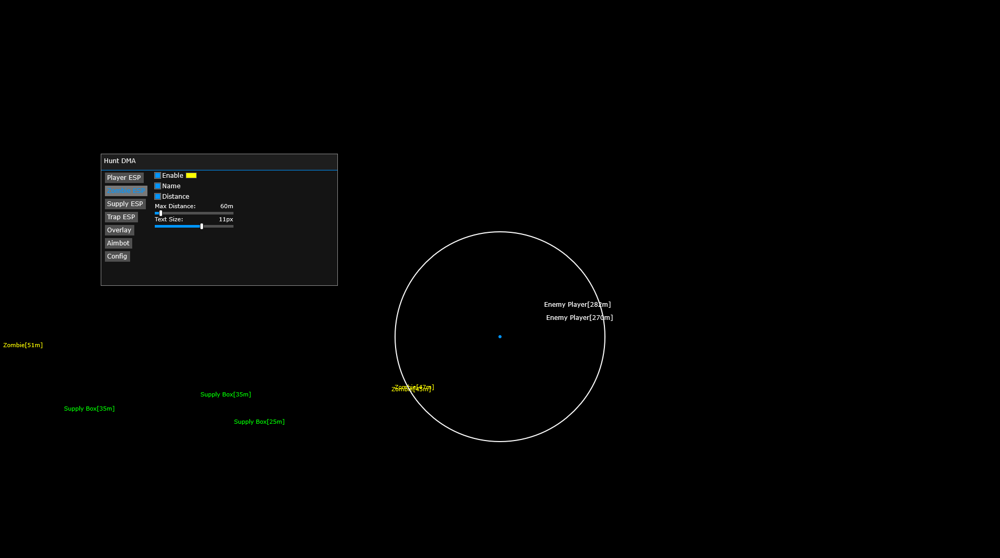
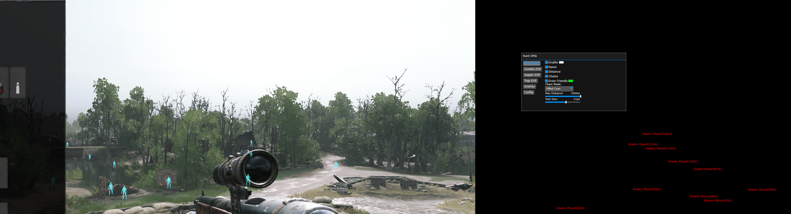

# Hunt DMA Cheat
Fully Featured Hunt DMA Cheat With Chams, Fuser ESP 

## Showcase

  

  

## Instructions
* [Installation Guide](./Instructions.md)
 

To Update: Change the SystemGlobalEnvironment Offset in SDK/Environment.h https://github.com/IntelSDM/HuntDMA/blob/67f7d5836460807b2686d123deeada08e5c76618/HuntDMA/SDK/Environment.h#L6
[This will likely be on Unknowncheats a day after any updates](https://www.unknowncheats.me/forum/other-fps-games/350352-hunt-showdown.html). Just go to the last page and someone will have posted it after an update.

## Fixed and Supported Features
* Player ESP
  * Name
  * Distance
  * Health
  * Chams
  * Friendly Color
  * Cham Color
* Boss ESP
  *  Name
  *  Distance
* Supply ESP
  * Name
  * Distance
  * Toggalable types
* BloodBound ESP (WIP)
  * Name
  * Distance
* Trap ESP
  * Name
  * Distance
* Points of Interest ESP
  * Name
  * Distance
* Config
  * Load
  * Save
* Spectating alarm
* FPS

### Player ESP
It's recommended to turn on after teammates are no longer tagged as enemy players or after raid starts. Then turn it off.

### Supply ESP
You can choose only your type of ammo, esp will show only nessesary items

### Trap ESP
Also barrels

### Points of Interest ESP
For now only Extraction Point

### Spectating alarm
Can't be turned off for now. Shows you red frame and in big green number how many players are spectating you. Your teammates counts.

## Credits
* [PCILeech](https://github.com/ufrisk/pcileech)
* [MemProcFS](https://github.com/ufrisk/MemProcFS)
* [insanefury](https://www.unknowncheats.me/forum/3809820-post343.html)
* [DMALibrary](https://github.com/Metick/DMALibrary/tree/Master)
* [Original HuntDMA](https://github.com/IntelSDM/HuntDMA)
