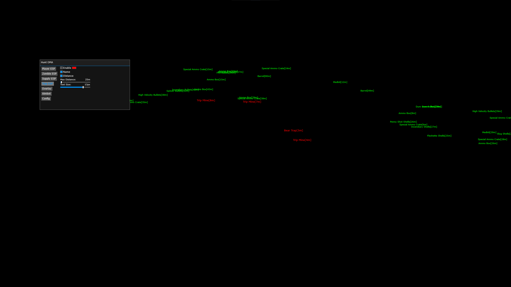

# Hunt DMA Cheat
Fully Featured Hunt DMA Cheat With Chams, Fuser ESP 

## Showcase

  

  

  
  
> [!IMPORTANT]
> * [Installation Guide](./Instructions.md)
> * Open menu key - **Insert**

To Update: Change the SystemGlobalEnvironment Offset in SDK/Environment.h https://github.com/IntelSDM/HuntDMA/blob/67f7d5836460807b2686d123deeada08e5c76618/HuntDMA/SDK/Environment.h#L6  
This will likely be on [Unknowncheats](https://www.unknowncheats.me/forum/other-fps-games/350352-hunt-showdown.html) a day after any updates. Just go to the last page and someone will have posted it after an update.

## Fixed and Supported Features
* Player ESP
  * Name
  * Distance
  * Health
  * Chams
  * Friendly Color
  * Cham Color
* Boss ESP
  *  Name
  *  Distance
* Supply ESP
  * Name
  * Distance
  * Toggalable types
* BloodBound ESP (WIP)
  * Name
  * Distance
* Trap ESP
  * Name
  * Distance
* Points of Interest ESP
  * Name
  * Distance
* Config
  * Load
  * Save
* Spectating alarm
* FPS

### Player ESP
It's recommended to turn on after teammates are no longer tagged as enemy players or after raid starts. Then turn it off.  
HP is: **current**/**current max(is not potential max if hunter is burning)**[**potential max hp after after all burns are healed**]

### Supply ESP
You can choose only your type of ammo, esp will show only nessesary items.

### Trap ESP
Also barrels.

### Points of Interest ESP
For now only Extraction Point.

### Spectating alarm
Can't be turned off for now. Shows you red frame and in big green number how many players are spectating you. Your teammates counts!

# Known Issues
If you start HuntDMA.exe and see ObjectCount < 2000 in the console, cheat will not work, you need to restart Hunt.exe.  
BloodBound ESP is not working.

# Todo
- [ ] Draw player list like in Mr Smile's cheat
- [ ] Draw ObjectCount
- [ ] Perks ESP/chams
- [ ] Fix DPI if it is set not to 100%
- [ ] Add check if player has escaped via extraction point
- [ ] View what is in player's hands
- [ ] If possible view player's names
- [ ] Zombie doctor's medkits are not shown as a supply
- [ ] Rewrite gui on nuklear or imGUI
- [x] Add close button for the menu
- [x] Fix spider not showing
- [x] Don't show players if their hp is <= 0 or > 150
- [x] Fix "Draw friendly"
- [x] Fix all "Enable" buttons
- [x] Spectator count
- [x] Expand Supply ESP with different tags
- [x] Add Golden Cash Register ESP
- [x] Add POI ESP
- [x] Draw players HP
- [x] Move configs to the same folder as HuntDMA.exe (previously at User/Documents/Hunt/Default.json.json)

## Credits
* [PCILeech](https://github.com/ufrisk/pcileech)
* [MemProcFS](https://github.com/ufrisk/MemProcFS)
* [insanefury](https://www.unknowncheats.me/forum/3809820-post343.html)
* [DMALibrary](https://github.com/Metick/DMALibrary/tree/Master)
* [Original HuntDMA by InterSDM](https://github.com/IntelSDM/HuntDMA)
* All amazing folks on UnknownCheats
